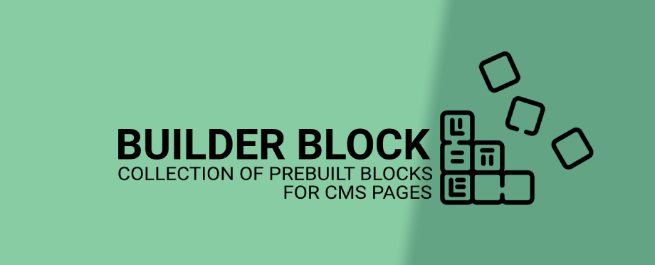
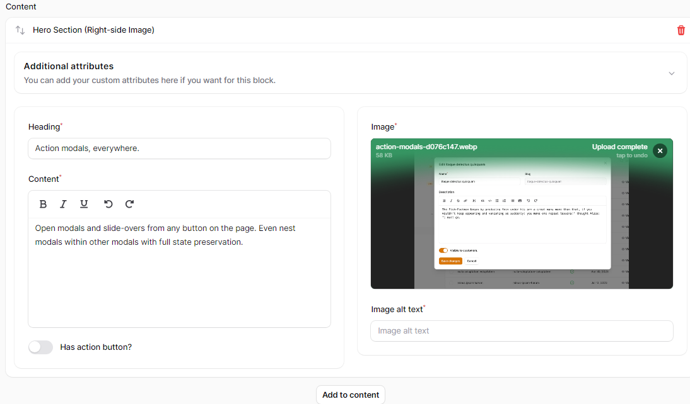
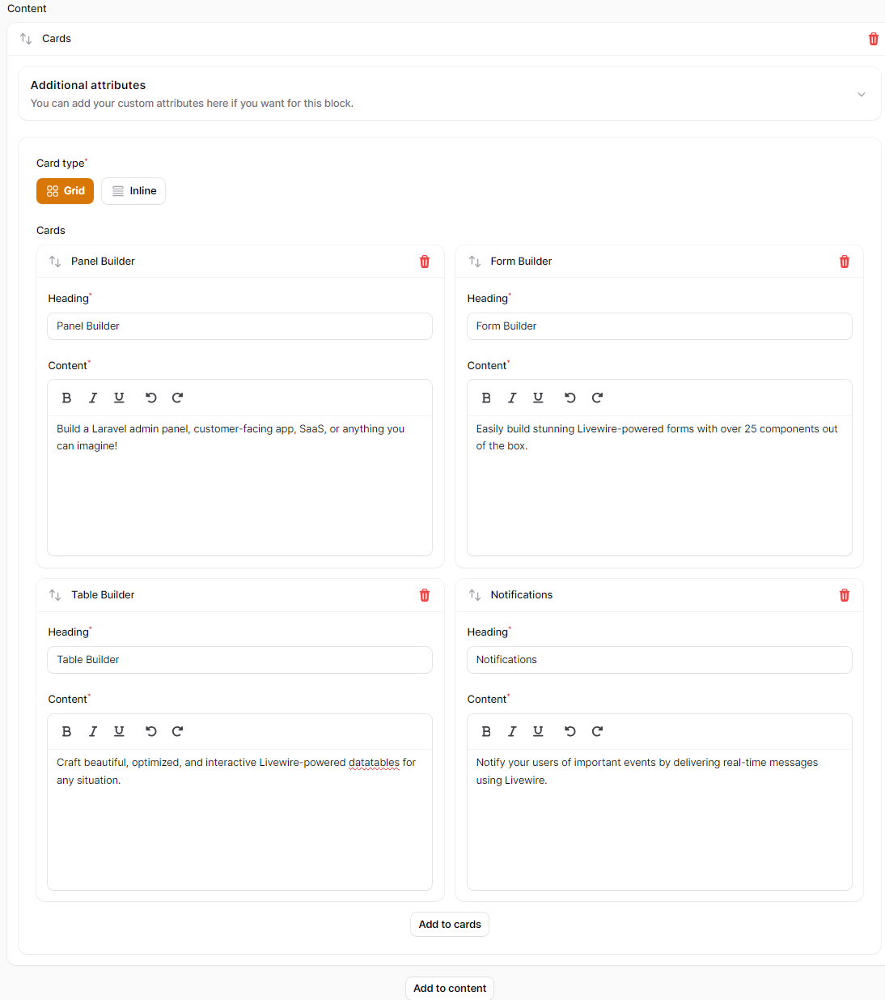
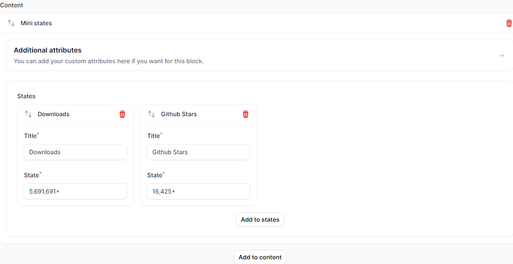
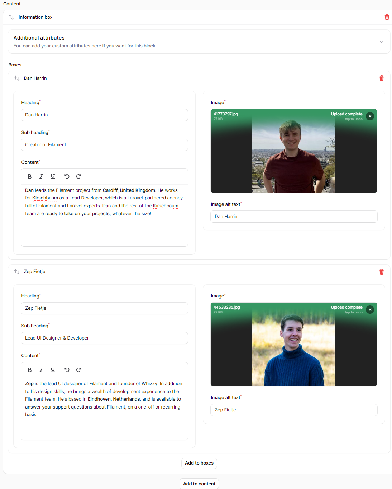
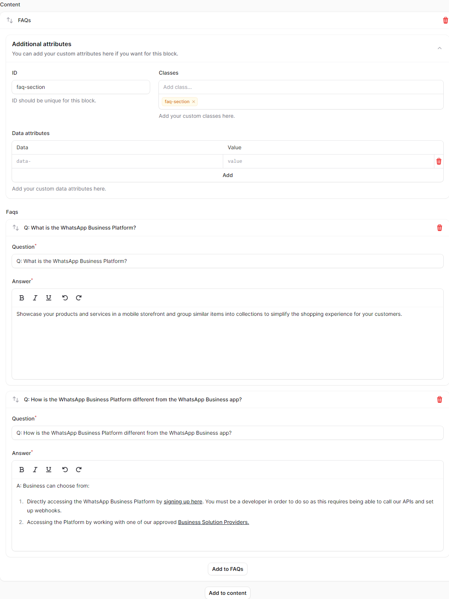

# Builder Block
<p align="center">

</p>

<p align="center">
<a href="https://packagist.org/packages/rmitesh/builder-block"></a>
<a href="https://packagist.org/packages/rmitesh/builder-block"></a>
<a href="https://laravel.com"></a>
<a href="https://php.net"></a>
</p>

Builder Block is collection of prebuilt Builder block of Filament for the CMS pages.
Everything will store in JSON format, using this data you can display content dynamically.

If you are using <a href="https://github.com/Z3d0X/filament-fabricator">Filament fabricator</a> then this is perfact package for your dynamic pages.

It comes with following blocks:

1. Hero section (Left and right side)


2. Cards


3. Mini states


4. Information boxes


5. FAQs



## Installation

You can install the package via composer:

```bash
composer require rmitesh/builder-block
```

## How to use

```php
use Filament\Forms;
use Filament\Forms\Form;
use Rmitesh\BuilderBlock\Facades\BuilderBlock;

public static function form(Form $form): Form
{
    return $form
        ->schema([
            // your components ...

            Forms\Components\Builder::make('content')
                ->blocks(
                    BuilderBlock::make()
                        ->get(),
                ),

            // your components ...
        ]);
}
```

and if you want to add your custom blocks then you can add using `addBlock` function.

```php
BuilderBlock::make()
    ->addBlock(
        Forms\Components\Builder\Block::make('my_custom_block')
            ->columns(4)
            ->icon('heroicon-m-information-circle')
            ->schema([
                // add your form components
            ]),
    )
    ->get()
```

Also, you can add multiple blocks using `addBlocks` function.

```php
BuilderBlock::make()
    ->addBlocks([
        Forms\Components\Builder\Block::make('my_custom_block_1')
            ->columns(4)
            ->icon('heroicon-m-information-circle')
            ->schema([
                // add your form components
            ]),
        
        Forms\Components\Builder\Block::make('my_custom_block_2')
            ->columns(4)
            ->icon('heroicon-m-information-circle')
            ->schema([
                // add your form components
            ]),
    ])
    ->get()
```

## Changelog

Please see [CHANGELOG](CHANGELOG.md) for more information on what has changed recently.

## Contributing

Please see [CONTRIBUTING](CONTRIBUTING.md) for details.

## Security Vulnerabilities

Please review [our security policy](../../security/policy) on how to report security vulnerabilities.

## Credits

- [Mitesh Rathod](https://github.com/rmitesh)
- [All Contributors](../../contributors)

## License

The MIT License (MIT). Please see [License File](LICENSE.md) for more information.
